# M031BSP_I2C_Slave_PMBus

Nuvoton M031 PMBus/SMBus slave firmware validation.

Last updated: 2026/06/18

## Overview

The firmware focuses on a standards-aligned PMBus slave transport path:

- SMBus/PMBus slave addressing and repeated START handling
- PEC generation and validation using CRC-8 polynomial 0x07
- SMBALERT#/ARA, ARP, and Zone alias support paths
- PMBus command dispatch aligned to PMBus 1.3.1 Part II command summary
- Runtime debug logs for RX decode and TX payload traceability
- Host-visible placeholder/shadow values for commands that are not yet connected to real PSU control or telemetry sources

## Target Hardware

| Item | Value |
| --- | --- |
| MCU | Nuvoton M031 series |
| Project board | M031 EVB or compatible custom M031 board |
| PMBus role | SMBus/PMBus slave |
| Default slave address | 0x5A, 7-bit |
| PMBus bus speed | 400 kHz target |
| Toolchain | Keil uVision5 with ARM Compiler 6 |
| Debug UART | UART0, 115200 8N1 |

## Pin Map

| Signal | Pin | Direction | Notes |
| --- | --- | --- | --- |
| PMBUS_SCL | PB5 | Input/output | I2C0 SCL, open-drain, external pull-up required |
| PMBUS_SDA | PB4 | Input/output | I2C0 SDA, open-drain, external pull-up required |
| PMBUS_ALERT# | PB6 | Output | Active-low SMBALERT#, open-drain, external pull-up required |
| UART0_RXD | PB12 | Input | Debug UART RX |
| UART0_TXD | PB13 | Output | Debug UART TX |
| HEARTBEAT | PB14 | Output | 1 second heartbeat toggle |
| GPIO_SPARE | PB15 | Output | Initialized spare output |

## Repository Layout

```text
Library/                                   Nuvoton BSP and driver library
SampleCode/Template/main.c                 Main firmware entry point
SampleCode/Template/board_config.h         Board-level pin and PMBus defaults
SampleCode/Template/misc_config.*          Clock, UART, GPIO, timer setup
SampleCode/Template/pmbus_io.*             Platform glue for PMBus IO behavior
SampleCode/Template/pmbus/                 PMBus protocol, dispatch, and platform code
SampleCode/Template/Keil/Template.uvprojx  Keil project
SampleCode/Template/PMBUS_SUPPORT_MATRIX.md
SampleCode/Template/PMBUS_VALIDATION_CHECKLIST.md
```

## Build

Open the Keil project:

```text
SampleCode/Template/Keil/Template.uvprojx
```

Expected build outputs:

```text
SampleCode/Template/Keil/obj/template.axf
SampleCode/Template/Keil/obj/template.hex
SampleCode/Template/Keil/obj/template.bin
```

## Runtime Behavior

At startup, the firmware initializes system clock, GPIO, UART0, Timer1, SysTick, timer service, and PMBus slave service.

The PMBus bus-critical path is handled in the I2C/PMBus interrupt path. 

Background code is used for debug printing and non-critical housekeeping only. 

This is intentional: SLA+W, SLA+R, repeated START, STOP, PEC, and TX byte preparation must not depend on slow background logging.

The main loop dispatches:

- Timer service tasks
- PMBus platform background task
- PMBus driver background task
- UART console reset commands

UART console reset commands:

```text
x, X, z, Z -> SYS_ResetChip()
```

## PMBus / SMBus Support

The implementation is intended to align with these documents:

- `docs/PMBus-Specification-Rev-1-3-1-Part-II-20150313.pdf` in the Pico HID Test Tool workspace
- `docs/PMBus_rev_1.2_part_1_september_2010.pdf` in the Pico HID Test Tool workspace

Supported transaction formats include:

- Send Byte
- Receive Byte
- Write Byte
- Write Word
- Read Byte
- Read Word
- Read 32
- Block Write
- Block Read
- Process Call
- Block Write-Read Process Call
- Group Command
- PEC enable/disable behavior
- SMBALERT#/ARA flow
- SMBus ARP placeholder flow
- PMBus Zone read/write alias flow

Command support and validation status are tracked in:

```text
SampleCode/Template/PMBUS_SUPPORT_MATRIX.md
SampleCode/Template/PMBUS_VALIDATION_CHECKLIST.md
```

## Important Product Note

Some PMBus commands currently return fixed values or volatile shadow values. 

These are useful for host-side protocol validation, 

but they are not final product behavior until connected to real product telemetry, control logic, fault sources, non-volatile storage, or an approved product policy.

Fixed-value or shadow-backed commands should keep source comments so future firmware work can trace where real product values must be connected.

## Typical Validation Setup

Hardware wiring with the Pico HID Test Tool as PMBus master:

| Pico signal | Pico pin | M031 signal | M031 pin |
| --- | --- | --- | --- |
| PMBus SDA | GP20 | PMBUS_SDA | PB4 |
| PMBus SCL | GP21 | PMBUS_SCL | PB5 |
| PMBus ALERT# | GP14 | PMBUS_ALERT# | PB6 |
| GND | GND | GND | GND |

Recommended validation flow:

1. Program the M031 firmware.
2. Open UART0 debug log at 115200 8N1.
3. Connect Pico HID Test Tool.
4. Open the PMBus tab.
5. Set address to `0x5A`.
6. Enable PEC.
7. Enable PMBus master.
8. Run `Scan`.
9. Run quick-test groups in order: `Basic`, `PEC`, `Error`, `Telemetry`, `Full`.
10. Confirm the tool log and MCU UART log match expected command, protocol, PEC, and payload behavior.

## Expected Validation Signals

A healthy scan should identify the device and read at least:

- `PMBUS_REVISION`
- `MFR_ID`
- `MFR_MODEL`

A healthy basic checklist should pass bus ACK, repeated START read, common write/readback, VOUT mode, and status reads.

A healthy PEC checklist should pass PEC-enabled read byte, read word, block read, and bad-PEC negative-path behavior.

A healthy telemetry checklist should decode fixed or shadow telemetry values and report PEC OK.

Manual checklist items remain manual when they require external board behavior, power-stage behavior, or logic-analyzer confirmation.

```
PMBus RX cmd=0x98 (PMBUS_REVISION) raw=2 payload=0 proto=4 rs=1 pec=1 valid=1
address=0xB4:[0x98],[0xDA],
PMBus TX cmd=0x98 (PMBUS_REVISION) proto=4 (READ_BYTE) len=2 value=0x33 | part1=1.3 | part2=1.3 | PEC OK | PEC(tx=0xAF, calc=0xAF)
```

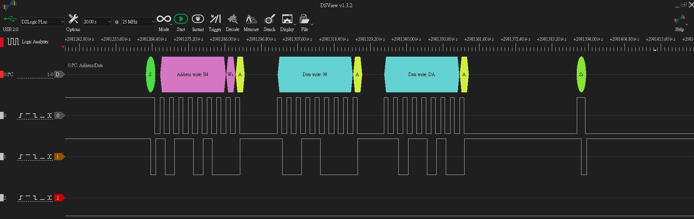

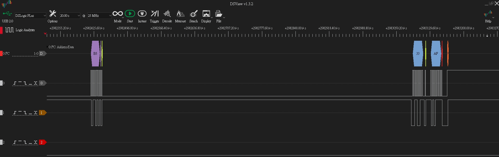


```
PMBus RX cmd=0x99 (MFR_ID) raw=2 payload=0 proto=8 rs=1 pec=1 valid=1
address=0xB4:[0x99],[0xDD],
PMBus TX cmd=0x99 (MFR_ID) proto=8 (BLOCK_READ) len=12 value="MFR_ID_001" | raw=0A 4D 46 52 5F 49 44 5F 30 30 31 | PEC OK | PEC(tx=0x0B, calc=0x0B)
```

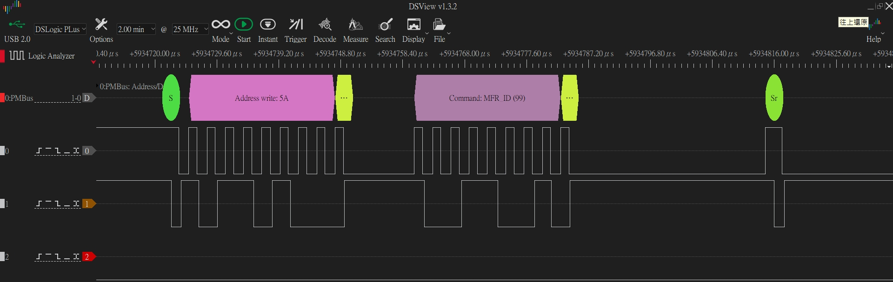

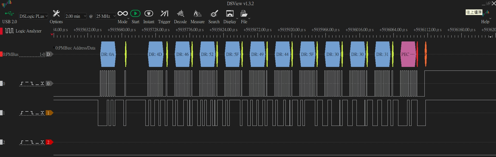


```
PMBus RX cmd=0x9A (MFR_MODEL) raw=2 payload=0 proto=8 rs=1 pec=1 valid=1
address=0xB4:[0x9A],[0xD4],
PMBus TX cmd=0x9A (MFR_MODEL) proto=8 (BLOCK_READ) len=15 value="MFR_MODEL_001" | raw=0D 4D 46 52 5F 4D 4F 44 45 4C 5F 30 30 31 | PEC OK | PEC(tx=0x06, calc=0x06)
```

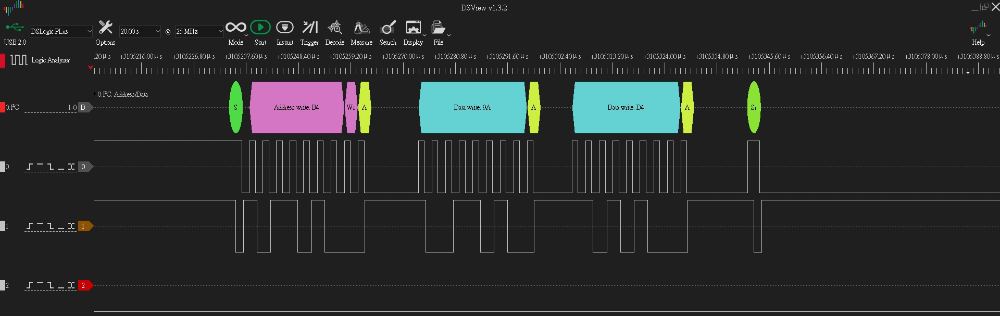

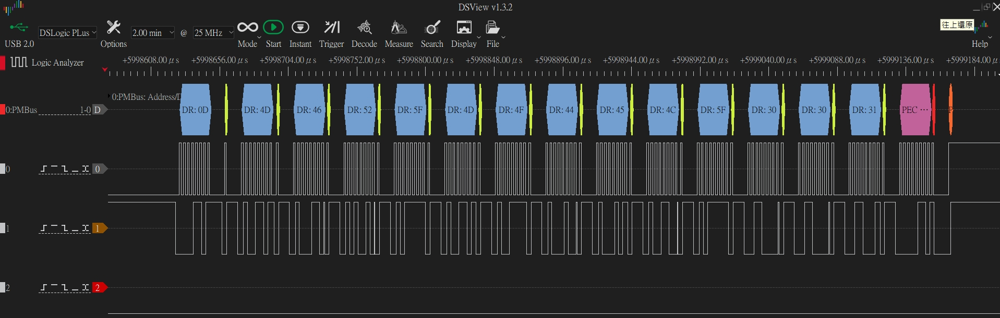


```
PMBus RX cmd=0x03 (CLEAR_FAULTS) raw=2 payload=0 proto=1 rs=0 pec=1 valid=1
address=0xB4:[0x03],[0x12],
PMBus write done cmd=0x03 len=0
```

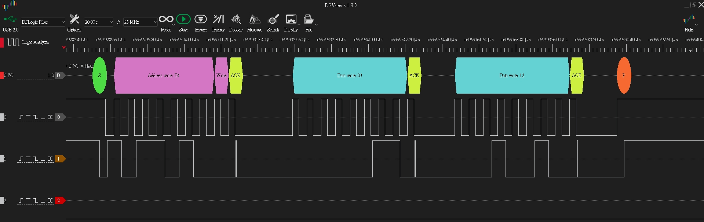


```
PMBus RX cmd=0x88 (READ_VIN) raw=2 payload=0 proto=5 rs=1 pec=1 valid=1
address=0xB4:[0x88],[0xAA],
PMBus TX cmd=0x88 (READ_VIN) proto=5 (READ_WORD) len=3 value=230.0000 | raw=0xF398 | PEC OK | PEC(tx=0x7B, calc=0x7B)
```

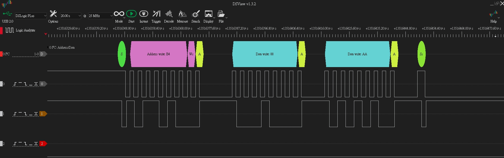

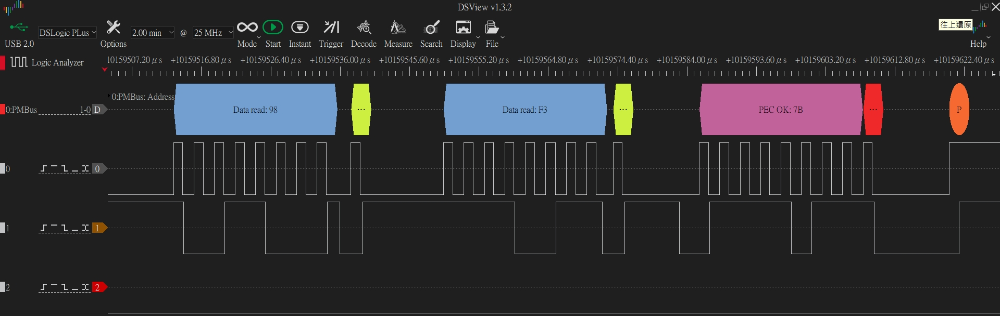


## Configuration Files

Primary configuration points:

```text
SampleCode/Template/board_config.h
SampleCode/Template/pmbus/pmbus_cfg_user.h
SampleCode/Template/pmbus/pmbus_protocol.h
```

`pmbus_cfg_user.h` holds portable PMBus user settings shared by M031, MS51, and future ports. Change this file for profile selection, command groups, PEC policy/backend, address aliases, debug output, and recovery thresholds.

`pmbus_protocol.h` holds fixed protocol constants such as `PMBUS_STATUS_*`, firmware-upload status bits, blackbox size, and `PMBUS_I2C_STATUS_*` ISR state codes. These values are used by the framework and should not be treated as user-configurable settings.

| Define | Default | Purpose |
| --- | --- | --- |
| `PMBUS_PROFILE` | `PMBUS_PROFILE_FULL` | Selects the default command group set. Use `PMBUS_PROFILE_MINIMAL` for smaller flash targets. |
| `PMBUS_PROFILE_MINIMAL` | `1U` | Enables core, status, telemetry, and basic manufacturer ID commands only. |
| `PMBUS_PROFILE_FULL` | `2U` | Enables the full PoC command surface, including limits, fan, energy, page-plus, zone, policy, ARP, and firmware-upload placeholders. |
| `PMBUS_ENABLE_CMD_CORE` | Profile derived | Core commands such as `PAGE`, `OPERATION`, `CLEAR_FAULTS`, `CAPABILITY`, `QUERY`, `VOUT_MODE`, `VOUT_COMMAND`. |
| `PMBUS_ENABLE_CMD_STATUS` | Profile derived | `STATUS_BYTE`, `STATUS_WORD`, and grouped status registers. |
| `PMBUS_ENABLE_CMD_TELEMETRY` | Profile derived | Common telemetry reads such as VIN, IIN, VOUT, IOUT, temperature, POUT, and PIN. |
| `PMBUS_ENABLE_CMD_LIMITS` | Profile derived | Limit, margin, sequencing, and response-policy shadows. Also enables automatic limit-threshold status policy. |
| `PMBUS_ENABLE_CMD_FAN` | Profile derived | Fan config/command and fan speed telemetry. |
| `PMBUS_ENABLE_CMD_ENERGY` | Profile derived | `READ_EIN`, `READ_EOUT`, and energy rollover shadows. |
| `PMBUS_ENABLE_CMD_MFR_BASIC` | Profile derived | `MFR_ID`, `MFR_MODEL`, `MFR_REVISION`, `MFR_SERIAL`. |
| `PMBUS_ENABLE_CMD_MFR_EXT` | Profile derived | Extended manufacturer placeholder commands, blackbox, and cold-redundancy shadow. |
| `PMBUS_ENABLE_CMD_PAGE_PLUS` | Profile derived | `PAGE_PLUS_WRITE`, `PAGE_PLUS_READ`, and `COEFFICIENTS` placeholder support. |
| `PMBUS_ENABLE_CMD_ZONE` | Profile derived | `ZONE_CONFIG` and `ZONE_ACTIVE` standard command support. |
| `PMBUS_ENABLE_CMD_POLICY` | Profile derived | Volatile `USER_DATA`, unassigned MFR-specific, and extended selector policy shadows. |
| `PMBUS_ENABLE_CMD_FWUPLOAD` | Profile derived | Vendor firmware-upload placeholder command flow. Production bootloader/storage is not implemented. |

Profile defaults:

| Feature group | Minimal | Full |
| --- | --- | --- |
| Core / Status / Telemetry / MFR Basic | On | On |
| Limits / Fan / Energy / MFR Ext / Page Plus / Zone / Policy / FWUpload | Off | On |
| ARP / Zone alias | Off | On |

Address and alias settings:

| Define | Default | Purpose |
| --- | --- | --- |
| `PMBUS_ADDRESS_7BIT_BASE` | `0x58U` | Base PMBus 7-bit address reference. |
| `PMBUS_ALERT_RESPONSE_ADDRESS_7BIT` | `0x0CU` | SMBus Alert Response Address. |
| `PMBUS_ARP_DEFAULT_ADDRESS_7BIT` | `0x61U` | SMBus ARP default address alias. |
| `PMBUS_ZONE_READ_ADDRESS_7BIT` | `0x28U` | PMBus Zone Read alias address. |
| `PMBUS_ZONE_WRITE_ADDRESS_7BIT` | `0x37U` | PMBus Zone Write alias address. |
| `PMBUS_ADDRESS_STRAP_00_7BIT` | `0x58U` | Address strap result for A1/A0 = 00. |
| `PMBUS_ADDRESS_STRAP_01_7BIT` | `0x59U` | Address strap result for A1/A0 = 01. |
| `PMBUS_ADDRESS_STRAP_10_7BIT` | `0x5AU` | Address strap result for A1/A0 = 10. |
| `PMBUS_ADDRESS_STRAP_11_7BIT` | `0x5BU` | Address strap result for A1/A0 = 11. |
| `PMBUS_ADDRESS_INVALID_FALLBACK_7BIT` | `PMBUS_ADDRESS_STRAP_10_7BIT` | Safe fallback when strap input is invalid. |
| `PMBUS_ADDRESS_7BIT_TO_WRITE(addr7)` | `(addr7 << 1)` | Converts a 7-bit address to the 8-bit write address shown by LA tools. |
| `PMBUS_ADDRESS_7BIT_TO_READ(addr7)` | `((addr7 << 1) \| 1)` | Converts a 7-bit address to the 8-bit read address shown by LA tools. |
| `PMBUS_ENABLE_ARA_ALIAS` | `1U` | Enables ARA alias handling. |
| `PMBUS_ENABLE_ARP` | Profile derived | Enables ARP default-address alias handling. |
| `PMBUS_ENABLE_ZONE_ALIAS` | Profile derived | Enables Zone Read/Write alias handling. |
| `PMBUS_I2C_ALIAS_SLOT_ARA` | `1U` | Platform alias slot used for ARA. |
| `PMBUS_I2C_ALIAS_SLOT_ARP` | `2U` | Platform alias slot used for ARP. |
| `PMBUS_I2C_ALIAS_SLOT_ZONE_READ` | `3U` | Platform alias slot used for Zone Read. |
| `PMBUS_I2C_ALIAS_SLOT_ZONE_WRITE` | `PMBUS_I2C_ALIAS_SLOT_DISABLED` | Zone Write alias is disabled by default on platforms without enough hardware alias slots. |

PEC and debug settings:

| Define | Default | Purpose |
| --- | --- | --- |
| `PMBUS_PEC_POLICY_DISABLED` | `0U` | Disables PEC generation/validation. |
| `PMBUS_PEC_POLICY_OPTIONAL` | `1U` | Accepts transactions with or without PEC, validates PEC when present, and appends read PEC for repeated-START reads. |
| `PMBUS_PEC_POLICY_REQUIRED` | `2U` | Requires PEC for write-side transactions. |
| `PMBUS_PEC_POLICY` | `PMBUS_PEC_POLICY_OPTIONAL` | Active PEC policy. PEC is enabled by default; use `PMBUS_PEC_POLICY_DISABLED` only for explicit bring-up tests. |
| `PMBUS_ENABLE_PEC` | Derived, enabled by default | Non-zero when `PMBUS_PEC_POLICY` is not disabled. |
| `PMBUS_PEC_BACKEND_SOFTWARE` | `0U` | Uses the portable bitwise CRC-8 implementation. |
| `PMBUS_PEC_BACKEND_HW_CRC` | `1U` | Uses the platform hardware CRC peripheral registers/macros in CRC-8 mode. No StdDriver `crc.c` link dependency is required on M031. |
| `PMBUS_PEC_BACKEND` | `PMBUS_PEC_BACKEND_HW_CRC` | Selects the PEC CRC backend. The hardware backend keeps the same byte-by-byte update API by loading the current PEC as the hardware seed. |
| `PMBUS_DEBUG_ENABLE` | `1U` | Enables queued background debug output. |
| `PMBUS_DEBUG_PRINT_RX_FRAME` | `1U` | Prints decoded RX frames and raw RX bytes for LA comparison. |
| `PMBUS_DEBUG_PRINT_TX_READY` | `1U` | Prints prepared TX frames. |
| `PMBUS_DEBUG_PRINT_TX_DECODE` | `1U` | Adds decoded telemetry/string values to TX logs. |
| `PMBUS_DEBUG_PRINT_WRITE_DONE` | `1U` | Prints completed write command summaries. |
| `PMBUS_DEBUG_PRINT_STATUS` | `0U` | Optional low-level I2C status logging. Usually kept off to avoid log noise. |

Buffer and recovery settings:

| Define | Default | Purpose |
| --- | --- | --- |
| `PMBUS_RX_BUFFER_SIZE` | `40U` | Fixed RX buffer size. |
| `PMBUS_TX_BUFFER_SIZE` | `34U` | Fixed TX buffer size, sized for 32-byte block data plus count/PEC headroom. |
| `PMBUS_MAX_BLOCK_SIZE` | `32U` | Maximum PMBus block payload length. |
| `PMBUS_DEBUG_QUEUE_SIZE` | `16U` | Background debug event queue depth. |
| `PMBUS_ENABLE_SLAVE_RECOVER` | `1U` | Enables stuck-bus / timeout recovery path. |
| `PMBUS_I2C_BUS_CLEAR_PULSES` | `9U` | SCL pulses used for bus-clear recovery. |
| `PMBUS_I2C_BUS_CLEAR_RETRY_COUNT` | `3U` | Bus-clear retry attempts. |
| `PMBUS_I2C_RECOVER_MAX_ATTEMPTS` | `3U` | Maximum PMBus slave recover attempts before fail event. |
| `PMBUS_I2C_RECOVER_BACKOFF_CYCLES` | `2U` | Background-task backoff cycles before recover. |
| `PMBUS_I2C_STUCK_BUS_RETRY_CYCLES` | `8U` | Debounce count before stuck-bus recovery is requested. |
| `PMBUS_I2C_TIMEOUT_RECOVER_THRESHOLD` | `1U` | Timeout flag threshold before recovery. |
| `PMBUS_I2C_BUS_ERROR_RECOVER_THRESHOLD` | `1U` | Bus-error threshold before recovery. |

`board_config.h` holds the platform porting contract. For a new MCU family, keep the PMBus common files unchanged and port these macros:

| Define group | Current M031 value / behavior |
| --- | --- |
| Address defaults | `PMBUS_DEFAULT_ADDRESS_A0_LEVEL=0U`, `PMBUS_DEFAULT_ADDRESS_A1_LEVEL=1U`, resulting in default 7-bit address `0x5A`. |
| I2C instance | `PMBUS_PORT_I2C_INSTANCE=I2C0`, `PMBUS_PORT_I2C_MODULE=I2C0_MODULE`, `PMBUS_PORT_I2C_IRQn=I2C0_IRQn`. |
| Bus clock | `PMBUS_PORT_I2C_BUS_CLOCK=400000UL`. |
| ISR contract | `PMBUS_PORT_I2C_IRQHandler` and `PMBUS_PORT_I2C_ISR_PROTOTYPE`. |
| Debug print | `PMBUS_DEBUG_PRINT=printf`. |
| Pin MFP / GPIO macros | `PMBUS_PORT_SET_I2C_PINS_MFP`, `PMBUS_PORT_SET_I2C_PINS_GPIO`, `PMBUS_PORT_INIT_I2C_PINS`, bus-clear SCL/SDA read/drive macros. |
| Alert macros | `PMBUS_PORT_INIT_ALERT_PIN`, `PMBUS_PORT_ALERT_ASSERT`, `PMBUS_PORT_ALERT_RELEASE`. |
| Address strap macros | `PMBUS_ADDRESS_STRAP_USE_GPIO`, `PMBUS_PORT_INIT_ADDRESS_PINS`, `PMBUS_PORT_READ_ADDRESS_A0`, `PMBUS_PORT_READ_ADDRESS_A1`. |

## Debug Logging

Debug logging is intentionally human-readable and command-aware. RX debug frames include command byte and command name when known. TX debug logs should print decoded values for telemetry commands so GUI logs can be correlated with MCU-side source values.

Do not print from timing-critical ISR paths. Queue or capture data in ISR and print from background processing.

RX debug logs use two lines:

```text
PMBus RX cmd=0x98 (PMBUS_REVISION) raw=2 payload=0 proto=4 rs=1 pec=1 valid=1
address=0xB4:[0x98],[0xDA],
```

The `address=0xB4` field is the 8-bit write address observed by the logic analyzer. The bracketed byte list is the complete RX byte stream captured after the address byte, from command byte through payload and optional PEC. For LA comparison, treat the frame as:

```text
[SLV write address],[command byte],...[PEC]
```

PEC CRC backend selection is independent from PEC policy. `PMBUS_PEC_POLICY` decides whether PEC is disabled, optional, or required. `PMBUS_PEC_BACKEND` only decides whether the CRC-8 math uses software or the platform hardware CRC peripheral. The hardware backend protects each byte update with a short interrupt-disabled section because the CRC peripheral is shared global state.

Use `PMBUS_PEC_POLICY_OPTIONAL` when the host is not forced to send PEC. This mode is useful for bring-up tools, LA comparison, and compatibility tests because incoming PEC is validated when present while non-PEC transactions remain accepted. Use `PMBUS_PEC_POLICY_REQUIRED` when the host must use PEC; write-side transactions without valid PEC are rejected and reported through CML status.

To switch PEC CRC implementation, set `PMBUS_PEC_BACKEND` in `pmbus_cfg_user.h`:

```c
#define PMBUS_PEC_BACKEND PMBUS_PEC_BACKEND_SOFTWARE
#define PMBUS_PEC_BACKEND PMBUS_PEC_BACKEND_HW_CRC
```

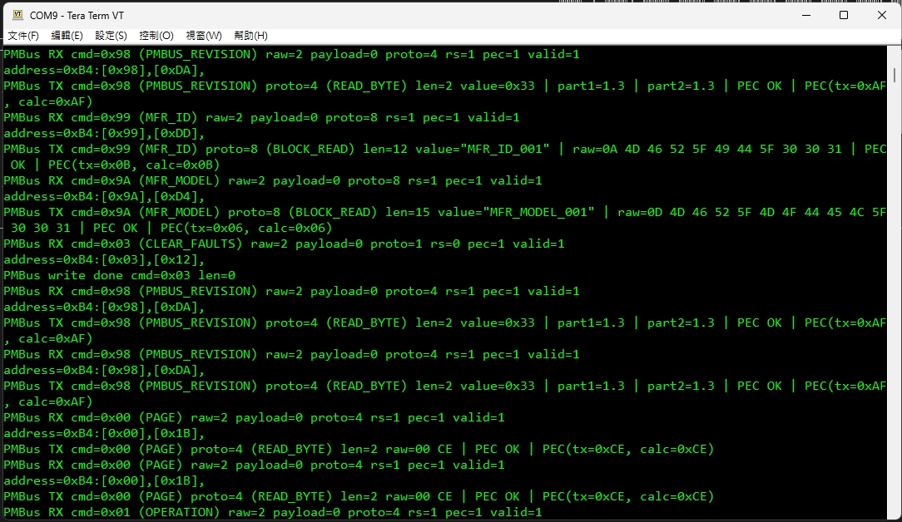

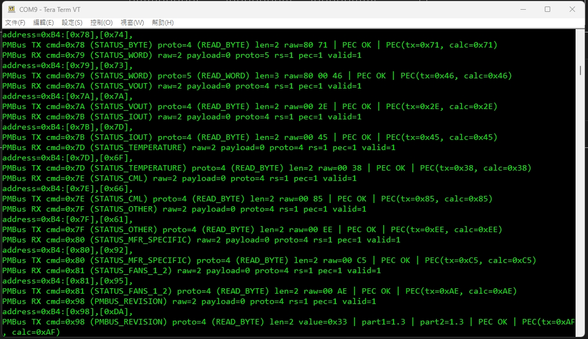

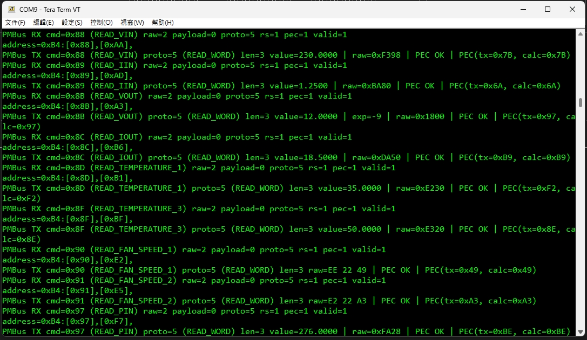

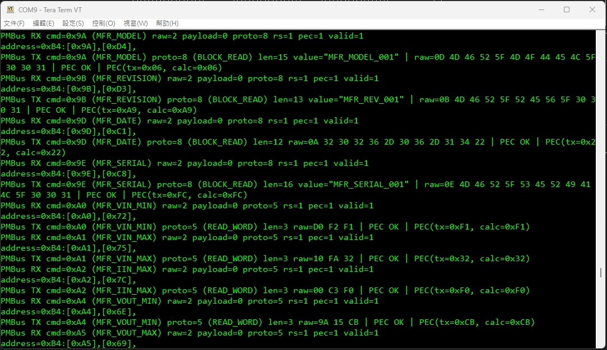


## Known Constraints

- External pull-ups are required on PMBus SCL, SDA, and ALERT#.
- Debug logging can change timing if used excessively; keep bus-critical behavior in ISR.
- Fixed-value telemetry must be replaced by real ADC/control data before product release.
- Non-volatile behavior for STORE/RESTORE/USER_DATA/MFR policy must be finalized by product requirements.

## Related Validation Documents

```text
SampleCode/Template/PMBUS_SUPPORT_MATRIX.md
SampleCode/Template/PMBUS_VALIDATION_CHECKLIST.md
Pico HID Test Tool repository: docs/PMBUS_TABLE31_GAP_MATRIX.md
```

## Revision History

| Date | Change |
| --- | --- |
| 2026/06/18 | Documented PMBus profile, command-group, PEC policy/backend, debug, alias/recovery, and platform porting defines; updated PMBus transaction and alias/recovery flow charts. |
| 2026/06/14 | Initial GitHub README draft created from MCU README template. |

## Mermaid Flow Charts

### Startup Flow

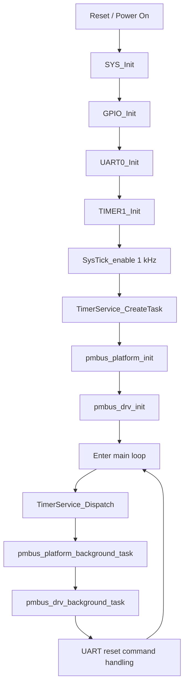

### PMBus Transaction Flow

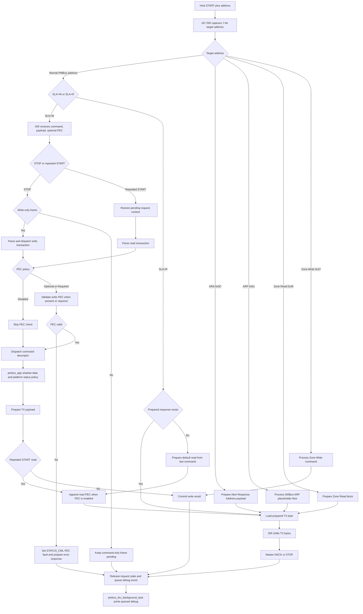

### Address Alias And Recovery Flow

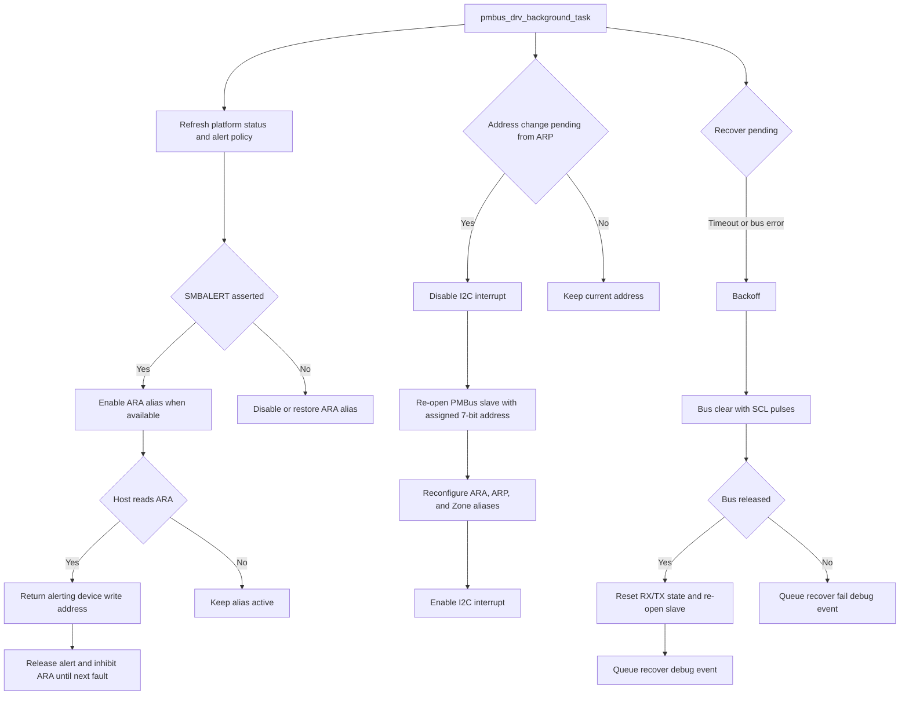
