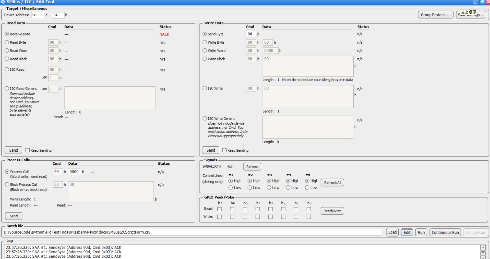
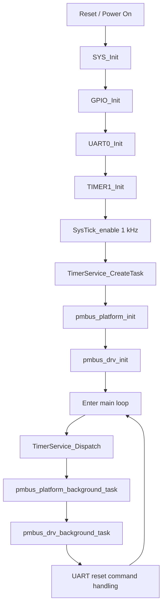
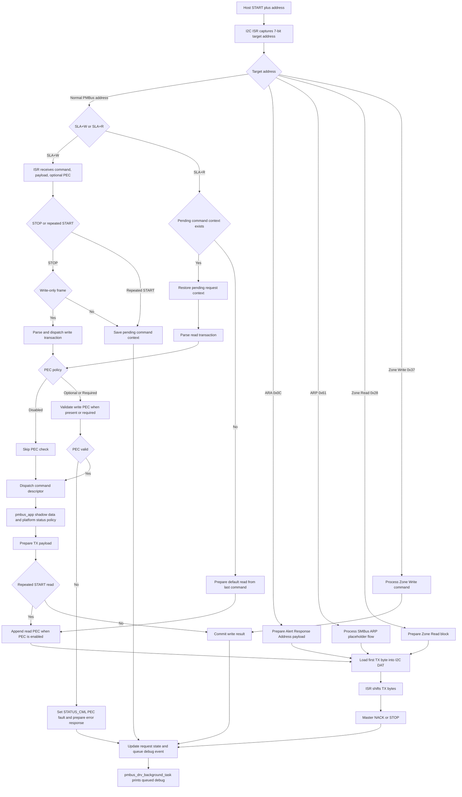
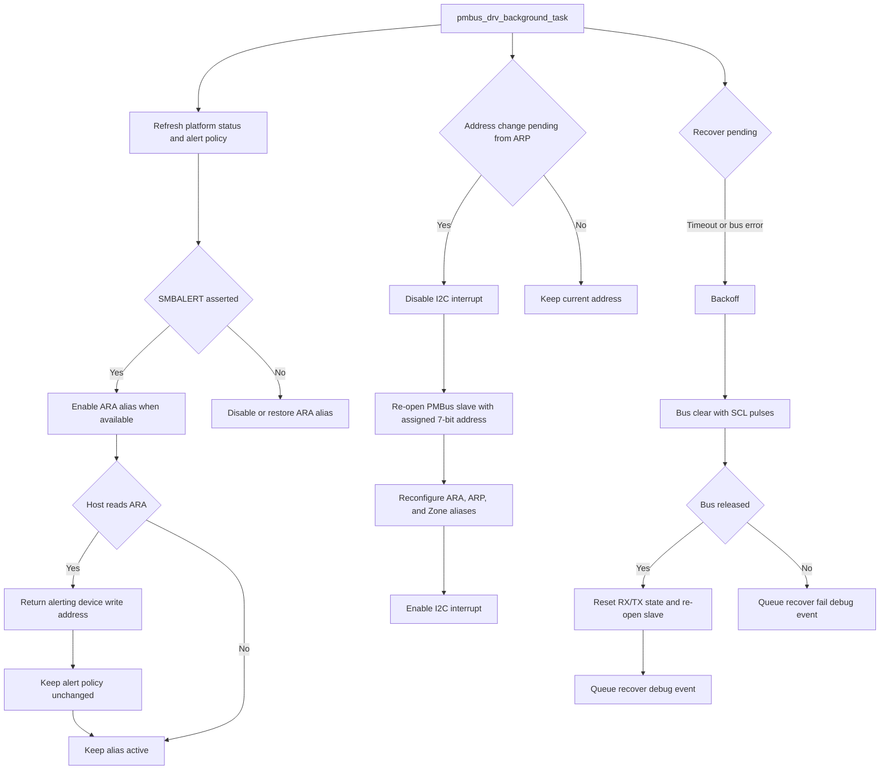

# M031BSP_I2C_Slave_PMBus

Nuvoton M031 PMBus/SMBus slave firmware validation.

Last updated: 2026/06/28

## Overview

The firmware focuses on a standards-aligned PMBus slave transport path:

- SMBus/PMBus slave addressing and normal combined-format repeated START handling
- PEC generation and validation using CRC-8 polynomial 0x07
- SMBALERT#/ARA, ARP, and Zone alias support paths
- PMBus command dispatch aligned to PMBus 1.3.1 Part II command summary
- Runtime debug logs for RX decode and TX payload traceability
- Host-visible placeholder/shadow values for commands that are not yet connected to real PSU control or telemetry sources

The firmware validates the MCU-side PMBus command execution path: command
decode, transaction dispatch, PEC, payload generation, status/error behavior,
and debug traceability. The PMBus/SMBus master host board and validation
GUI/tool are not prescribed by this workspace and must be selected by the user.

## Target Hardware

| Item | Value |
| --- | --- |
| MCU | Nuvoton M031 series |
| Project board | M031 EVB or compatible custom M031 board |
| PMBus role | SMBus/PMBus slave |
| Default slave address | 0x5A, 7-bit |
| PMBus bus speed | 400 kHz target |
| Toolchain | Keil uVision5 with ARM Compiler 6 |
| Debug UART | UART0, 115200 8N1 |

Hardware SMBus note:

- This firmware uses the normal I2C slave controller plus software PMBus/SMBus handling.
- It must not depend on hardware SMBus Bus Management / PEC registers such as `I2C_BUSCTL`, `I2C_BUSTCTL`, `I2C_BUSSTS`, `I2C_PKTSIZE`, `I2C_PKTCRC`, `I2C_BUSTOUT`, or `I2C_CLKTOUT`.
- PEC, block transaction sizing, ARA/ARP policy, and PMBus command semantics are implemented in software.
- Software SCL-low timeout is sampled from `TMR1_IRQHandler()` at 1 ms cadence. The default timeout threshold is `PMBUS_I2C_CLOCK_LOW_TIMEOUT_MS=35U`.
- Any ordinary I2C timeout counter used by the port layer is only a recovery aid; the software SCL-low monitor is the portable SMBus clock-low timeout path for this M032 target.

## Pin Map

| Signal | Pin | Direction | Notes |
| --- | --- | --- | --- |
| PMBUS_SCL | PB5 default | Input/output | Default `PMBUS_PORT_PROFILE_M031_I2C0_PB4_PB5`, I2C0 SCL, open-drain, external pull-up required |
| PMBUS_SDA | PB4 default | Input/output | Default `PMBUS_PORT_PROFILE_M031_I2C0_PB4_PB5`, I2C0 SDA, open-drain, external pull-up required |
| PMBUS_ALERT# | PB6 | Output | Active-low SMBALERT#, open-drain, external pull-up required |
| UART0_RXD | PB12 | Input | Debug UART RX |
| UART0_TXD | PB13 | Output | Debug UART TX |
| HEARTBEAT | PB14 | Output | 1 second heartbeat toggle |
| GPIO_SPARE | PB15 | Output | Initialized spare output |

## Repository Layout

```text
Library/                                   Nuvoton BSP and driver library
SampleCode/Template/main.c                 Main firmware entry point
SampleCode/Template/board_config.h         Board-level pin and PMBus defaults
SampleCode/Template/misc_config.*          Clock, UART, GPIO, timer setup
SampleCode/Template/pmbus_io.*             Platform glue for PMBus IO behavior
SampleCode/Template/pmbus/                 PMBus protocol, dispatch, and platform code
SampleCode/Template/Keil/Template.uvprojx  Keil project
SampleCode/Template/PMBUS_SUPPORT_MATRIX.md
SampleCode/Template/PMBUS_VALIDATION_CHECKLIST.md
SMBusI2CScriptForm.csv                     TI SMBus/I2C/SAA Tool ScriptForm validation sequence
teraterm_TI_script.log                     Reference UART capture from the TI ScriptForm run
TI_SMBus_I2C_SAA_Tool_Batch_file.jpg       TI SMBus/I2C/SAA Tool batch-file setup screenshot
```

## Build

Open the Keil project:

```text
SampleCode/Template/Keil/Template.uvprojx
```

Expected build outputs:

```text
SampleCode/Template/Keil/obj/template.axf
SampleCode/Template/Keil/obj/template.hex
SampleCode/Template/Keil/obj/template.bin
```

## Runtime Behavior

At startup, the firmware initializes system clock, GPIO, UART0, Timer1, SysTick, timer service, and PMBus slave service.

The PMBus bus-critical path is handled in the I2C/PMBus interrupt path. 

Background code is used for debug printing and non-critical housekeeping only. 

This is intentional: SLA+W, SLA+R, repeated START, STOP, PEC, and TX byte preparation must not depend on slow background logging.

Software SCL-low timeout sampling is also not done in the polling loop. `TMR1_IRQHandler()` calls `pmbus_drv_timer_1ms()`, which samples PMBUS_SCL once per millisecond and latches recovery when SCL stays low for `PMBUS_I2C_CLOCK_LOW_TIMEOUT_MS`. The actual bus-clear/re-open sequence still runs in `pmbus_drv_background_task()` so the timer ISR remains short.

The 1 ms timeout sampler guards shared PMBus driver state by disabling/enabling only the I2C NVIC IRQ through `pmbus_io_i2c_irq_guard()`. It does not toggle the I2C peripheral interrupt enable bit.

If the ordinary I2C timeout flag is pending when the I2C ISR runs, the driver clears the flag but still handles the current active I2C status before clearing SI. A timeout flag must not bypass `SLA_R_ACK`, `DATA_TX_ACK`, `DATA_RX_ACK`, or `STOP_RESTART`, because doing so can release SCL before DAT/RX state is updated.

Normal slave-transmit endings are treated separately from real bus faults. If the I2C controller reports one `0x00` status immediately after `DATA_TX_NACK` / `LAST_TX_ACK`, the driver treats it as TX cleanup and does not latch CML, ALERT#, ARA, or recovery. A genuinely stuck bus is still handled by the software SCL-low timeout and bus-clear path.

Command-only repeated-start reads use the normal SMBus combined-format flow. `STOP_RESTART` only saves the pending command context; `SLA_R_ACK` restores that context, dispatches/prepares the PMBus response, writes the first response byte to I2C DAT, and then advances the TX index. The read address byte (`0xB5` for target `0x5A`) must never appear as PMBus response data on the logic analyzer.

The main loop dispatches:

- Timer service tasks
- PMBus platform background task
- PMBus driver background task
- UART console reset commands

UART console reset commands:

```text
x, X, z, Z -> SYS_ResetChip()
```

## PMBus / SMBus Support

The implementation is intended to align with these documents:

- `PMBus-Specification-Rev-1-3-1-Part-I-20150313.pdf`
- `PMBus-Specification-Rev-1-3-1-Part-II-20150313.pdf`
- `PMBus-Specification-Rev-1-3-1-Part-III-20150313.pdf`, as AVSBus reference only; AVSBus is not implemented by this M032 PMBus/SMBus sample
- `M-CRPS_Base_Specification_version_1p06p00_RC1-draft7_042026.pdf`, for the optional CRPS product-profile command overlay
- `UCD90xxx Sequencer and System Health Controller PMBus Command Reference.pdf`, for the TI UCD90xxx command-name profile namespace

Supported transaction formats include:

- Send Byte
- Receive Byte
- Write Byte
- Write Word
- Read Byte
- Read Word
- Read 32
- Block Write
- Block Read
- Process Call
- Block Write-Read Process Call
- Group Command
- PEC enable/disable behavior
- SMBALERT#/ARA flow
- SMBus ARP placeholder flow
- PMBus Zone read/write alias flow

Profile policy:

- The base PMBus profile follows [PMBus 1.3.1 specification archive](https://pmbus.org/specification-archives/?cn-reloaded=1), using local copies `PMBus-Specification-Rev-1-3-1-Part-I-20150313.pdf` and `PMBus-Specification-Rev-1-3-1-Part-II-20150313.pdf`; it does not assign product meaning to generic `USER_DATA_*` or unowned `MFR_SPECIFIC_*` commands.
- The CRPS profile is enabled by `PMBUS_ENABLE_CMD_CRPS` and maps the public [OCP M-CRPS v1.06 specification source](https://www.opencompute.org/wiki/Server/MHS/DC-MHS-Specs-and-Designs), local copy `M-CRPS_Base_Specification_version_1p06p00_RC1-draft7_042026.pdf` Table 12-38 command names, to deterministic placeholder/shadow handlers.
- `PMBUS_COMMAND_PROFILE` selects the profile-specific command-name namespace used by debug logs and support reporting. It is intentionally separate from `PMBUS_ENABLE_CMD_CRPS` and `PMBUS_PROFILE_MINIMAL/FULL`.
  - Base example: `0xE3 -> MFR_SPECIFIC_E3`
  - M-CRPS example: `0xE3 -> MFR_FWUPLOAD_BLOCK_SIZE`
  - TI UCD90xxx example: `0xE3 -> PARM_VALUE`
- If a profile overlay group such as `PMBUS_ENABLE_CMD_CRPS` is disabled, its code points fall back to the generic Base `MFR_SPECIFIC_*` bounded volatile block shadow unless another compiled descriptor owns that command. They must not remain permanently reserved as unsupported commands.
- Profile-specific command ownership must follow the selected `PMBUS_COMMAND_PROFILE`. For example, `0xD7` is M-CRPS `MFR_FWUPLOAD` only in the M-CRPS profile; in the TI UCD90xxx profile it is `RUN_TIME_CLOCK` Block. TI overlay protocols such as `0xD0 SEQ_TIMEOUT` Word, `0xD1 VOUT_CAL_MONITOR` Word, `0xDA USER_RAM_00` Byte, and `0xF3 MFR_STATUS` Block must not be blocked by Base/M-CRPS descriptors.
- `PMBUS_SYSTEM_POLICY` is independent from the command profile. `PMBUS_SYSTEM_POLICY_PRODUCTION_DEFAULT` keeps optional lab helpers such as ARA alias and ARP disabled by default, while `PMBUS_SYSTEM_POLICY_LAB_VALIDATION` enables them for lab validation.
- CRPS placeholder values are intentionally stable for host validation; source comments mark where real PSU telemetry, inventory, blackbox, firmware-upload, LED, timing, and protection policy must be connected later.
- UCD90xxx command names are available through `PMBUS_COMMAND_PROFILE_TI_UCD90XXX` and follow the [TI UCD90xxx PMBus command reference](https://www.ti.com/lit/ug/slvu352g/slvu352g.pdf), local copy `UCD90xxx Sequencer and System Health Controller PMBus Command Reference.pdf`. Target-specific UCD90xxx device emulation remains product/application policy and should be implemented separately from the common PMBus transport.

Command support and validation status are tracked in:

```text
SampleCode/Template/PMBUS_SUPPORT_MATRIX.md
SampleCode/Template/PMBUS_VALIDATION_CHECKLIST.md
```

## Profile Validation Log Reference

The repository root keeps UART/TeraTerm captures for the currently validated M031 command profiles. When a command byte is profile-owned, use the log that matches the active `PMBUS_COMMAND_PROFILE`; the same byte can have a different command name, protocol, and payload in another profile.

| Active validation profile | M031 `PMBUS_COMMAND_PROFILE` | UART log file | Main command namespace to compare |
| --- | --- | --- | --- |
| `PMBus Base` | `PMBUS_COMMAND_PROFILE_BASE` | `teraterm_PROFILE_BASE.log` | PMBus public commands plus generic `USER_DATA_*` and `MFR_SPECIFIC_C0..FD` shadows. |
| `M-CRPS` | `PMBUS_COMMAND_PROFILE_M_CRPS` | `teraterm_PROFILE_M_CRPS.log` | M-CRPS Table 12-38 profile commands and placeholder/shadow responses. |
| `TI UCD90xxx` | `PMBUS_COMMAND_PROFILE_TI_UCD90XXX` | `teraterm_TI_UCD90XXX.log` | TI UCD90xxx profile command names and representative Byte/Word/Block smoke coverage. |

Common PMBus commands such as `PMBUS_REVISION`, `MFR_ID`, `MFR_MODEL`, status, telemetry, PEC, and error-path probes appear in the validation run for each profile. For profile-specific MFR/vendor bytes, compare against the matching profile log only.

Profile-dependent examples captured in the attached logs:

| Command byte | Base profile log | M-CRPS profile log | TI UCD90xxx profile log |
| --- | --- | --- | --- |
| `0xD0` | `MFR_SPECIFIC_D0`, `READ_BYTE` | `MFR_COLD_REDUNDANCY_CONFIG`, `READ_BYTE` / `WRITE_BYTE` | `SEQ_TIMEOUT`, `READ_WORD` |
| `0xD1` | `MFR_SPECIFIC_D1`, `BLOCK_READ` | `MFR_READ_CONFIG_FILE_SIZE`, `BLOCK_READ` | `VOUT_CAL_MONITOR`, `READ_WORD` |
| `0xD7` | Generic Base `MFR_SPECIFIC_D7` namespace; not a current read-sweep example in the attached Base log. | M-CRPS `MFR_FWUPLOAD` side-effect command; not part of the current automated read-sweep examples. | `RUN_TIME_CLOCK`, `BLOCK_READ` |
| `0xDA` | `MFR_SPECIFIC_DA`, `BLOCK_READ` | `MFR_SPDM`, `BLOCK_WRITE_READ_PROCESS_CALL` | `USER_RAM_00`, `READ_BYTE` |
| `0xE1` | `MFR_SPECIFIC_E1`, `BLOCK_READ` | `MFR_LINE_STATUS`, `READ_BYTE` / `WRITE_BYTE` | `PWM_CONFIG`, `BLOCK_READ` |
| `0xE2` | `MFR_SPECIFIC_E2`, `BLOCK_READ` | `MFR_SYSTEM_LED_CNTL`, `READ_WORD` / `WRITE_WORD` | `PARM_INFO`, `BLOCK_READ` |
| `0xE3` | `MFR_SPECIFIC_E3`, `BLOCK_READ` | `MFR_FWUPLOAD_BLOCK_SIZE`, `READ_WORD` | `PARM_VALUE`, `BLOCK_READ` |
| `0xEE` | `MFR_SPECIFIC_EE`, `BLOCK_READ` | `MFR_OCWPL1_SETTING`, `BLOCK_READ` | `LOGGED_COMMON_PEAKS`, `READ_BYTE` |
| `0xF3` | `MFR_SPECIFIC_F3`, `BLOCK_READ` | `MFR_FPC_12VSB_MIN_OFF_TIME`, `READ_WORD` / `WRITE_WORD` | `MFR_STATUS`, `BLOCK_READ` |

## Important Product Note

Some PMBus commands currently return fixed values or volatile shadow values. 

These are useful for host-side protocol validation, 

but they are not final product behavior until connected to real product telemetry, control logic, fault sources, non-volatile storage, or an approved product policy.

Fixed-value or shadow-backed commands should keep source comments so future firmware work can trace where real product values must be connected.

## Typical Validation Setup

Hardware wiring with a user-provided PMBus/SMBus master host board:

| Host signal | Host pin | M031 signal | M031 pin |
| --- | --- | --- | --- |
| PMBus SDA | User selected | PMBUS_SDA | PB4 default profile |
| PMBus SCL | User selected | PMBUS_SCL | PB5 default profile |
| PMBus ALERT# | User selected, optional | PMBUS_ALERT# | PB6 |
| GND | GND | GND | GND |

Recommended validation flow:

1. Program the M031 firmware.
2. Open UART0 debug log at 115200 8N1.
3. Connect the user-selected PMBus/SMBus master host board.
4. Open or run the user-selected PMBus/SMBus validation GUI/tool.
5. Select the validation profile that matches the active `PMBUS_COMMAND_PROFILE` in `pmbus_cfg_user.h`; do not assume the sample is always built as `PMBus Base`.
6. Set address to `0x5A`.
7. Enable PEC.
8. Enable the PMBus/SMBus master path in the selected host tool.
9. Run `Scan`.
10. Run quick-test groups in order: `Basic`, `PEC`, `Error`, `Telemetry`, `MFR`, `Full`.
11. Confirm the tool log and MCU UART log match expected command, protocol, PEC, and payload behavior.

## TI USB-to-GPIO ScriptForm Validation

This workspace also includes a host-side reference run using a TI USB-to-GPIO adapter with the TI SMBus & I2C & SAA Debug Tool batch-file flow. This is an optional validation path for checking the MCU PMBus slave without depending on any particular GUI implementation.

The TI host utility is included with TI Fusion Digital Power Designer:

```text
https://www.ti.com/tool/FUSION_DIGITAL_POWER_DESIGNER
```

After installing Fusion Digital Power Designer, use the included `SMBus & I2C & SAA Debug Tool` to run the ScriptForm CSV. The included script is mainly for the M-CRPS profile because most scripted PMBus/SMBus commands follow the M-CRPS command namespace and validation order.

Reference files:

| File | Purpose |
| --- | --- |
| `SMBusI2CScriptForm.csv` | TI ScriptForm CSV sequence generated from the M-CRPS validation command order. |
| `TI_SMBus_I2C_SAA_Tool_Batch_file.jpg` | Screenshot of the TI SMBus & I2C & SAA Debug Tool batch-file setup. |
| `teraterm_TI_script.log` | UART0 capture from the MCU while the TI ScriptForm sequence was running. |



Recommended TI ScriptForm setup:

1. Program this firmware and open UART0 at `115200 8N1`.
2. Connect TI USB-to-GPIO to the PMBus pins and common GND.
3. Set the target 7-bit address to `0x5A`.
4. Import or run `SMBusI2CScriptForm.csv` from the TI SMBus & I2C & SAA Debug Tool batch-file flow.
5. Keep the `Pause,10,` row after each command. It gives the 115200-baud debug UART enough time to drain during long scripted runs.
6. Match the firmware build profile with the script profile. The included reference CSV targets the M-CRPS command namespace and should be regenerated before using it as a PMBus Base or TI UCD90xxx profile script.

Reference run summary from `teraterm_TI_script.log`:

| Item | Result |
| --- | --- |
| Executable script commands | 1275 |
| `Pause,10,` rows | 1275 |
| MCU RX frames logged | 1275 |
| MCU TX frames logged | 1183 |
| `PMBus PEC error` lines | 0 |
| RX frames with `valid=0` | 0 |
| Unsupported-command lines | 8 expected negative-path probes |

Representative discovery/readback log:

```text
PMBus RX cmd=0x98 (PMBUS_REVISION) raw=1 payload=0 proto=4 rs=1 pec=0 valid=1
PMBus TX cmd=0x98 (PMBUS_REVISION) proto=4 (READ_BYTE) len=2 value=0x33 | part1=1.3 | part2=1.3 | PEC OK | PEC(tx=0xAF, calc=0xAF)
PMBus RX cmd=0x99 (MFR_ID) raw=1 payload=0 proto=8 rs=1 pec=0 valid=1
PMBus TX cmd=0x99 (MFR_ID) proto=8 (BLOCK_READ) len=12 value="MFR_ID_001" | raw=0A 4D 46 52 5F 49 44 5F 30 30 31 | PEC OK | PEC(tx=0x0B, calc=0x0B)
PMBus RX cmd=0x9A (MFR_MODEL) raw=1 payload=0 proto=8 rs=1 pec=0 valid=1
PMBus TX cmd=0x9A (MFR_MODEL) proto=8 (BLOCK_READ) len=15 value="MFR_MODEL_001" | raw=0D 4D 46 52 5F 4D 4F 44 45 4C 5F 30 30 31 | PEC OK | PEC(tx=0x06, calc=0x06)
```

Representative write-only frame with PEC:

```text
PMBus RX cmd=0x03 (CLEAR_FAULTS) raw=2 payload=0 proto=1 rs=0 pec=1 valid=1
address=0xB4:[0x03],[0x12],
PMBus write done cmd=0x03 len=0
```

Representative M-CRPS profile command decode:

```text
PMBus RX cmd=0xD0 (MFR_COLD_REDUNDANCY_CONFIG) raw=1 payload=0 proto=4 rs=1 pec=0 valid=1
address=0xB4:[0xD0],
PMBus TX cmd=0xD0 (MFR_COLD_REDUNDANCY_CONFIG) proto=4 (READ_BYTE) len=2 raw=00 E1 | PEC OK | PEC(tx=0xE1, calc=0xE1)
PMBus RX cmd=0xE3 (MFR_FWUPLOAD_BLOCK_SIZE) raw=1 payload=0 proto=5 rs=1 pec=0 valid=1
address=0xB4:[0xE3],
PMBus TX cmd=0xE3 (MFR_FWUPLOAD_BLOCK_SIZE) proto=5 (READ_WORD) len=3 raw=20 00 94 | PEC OK | PEC(tx=0x94, calc=0x94)
```

Representative negative-path probes:

```text
PMBus RX cmd=0x0F (UNKNOWN) raw=3 payload=2 proto=0 rs=0 pec=0 valid=1
address=0xB4:[0x0F],[0x36],[0x00],
PMBus unsupported cmd=0x0F frame=3
PMBus RX cmd=0x7E (STATUS_CML) raw=1 payload=0 proto=4 rs=1 pec=0 valid=1
address=0xB4:[0x7E],
PMBus TX cmd=0x7E (STATUS_CML) proto=4 (READ_BYTE) len=2 raw=80 0C | PEC OK | PEC(tx=0x0C, calc=0x0C)

PMBus RX cmd=0x79 (STATUS_WORD) raw=3 payload=2 proto=0 rs=0 pec=0 valid=1
address=0xB4:[0x79],[0x73],[0x00],
PMBus unsupported cmd=0x79 frame=3
PMBus RX cmd=0x7E (STATUS_CML) raw=1 payload=0 proto=4 rs=1 pec=0 valid=1
address=0xB4:[0x7E],
PMBus TX cmd=0x7E (STATUS_CML) proto=4 (READ_BYTE) len=2 raw=40 42 | PEC OK | PEC(tx=0x42, calc=0x42)
```

The `0x0F` unsupported command and write-form `0x79` `STATUS_WORD` rows are intentional negative-path checks from the script. They should produce `PMBus unsupported cmd=...` and then set/verify `STATUS_CML`; they are not transport failures.

## Expected Validation Signals

A healthy scan should identify the device and read at least:

- `PMBUS_REVISION`
- `MFR_ID`
- `MFR_MODEL`

During a healthy scan, the UART log should not show `PMBus slave recover addr7=... reason=2` or automatic ARA alias enable immediately after normal read responses.

A healthy basic checklist should pass bus ACK, repeated START read, common write/readback, VOUT mode, and status reads.

A healthy PEC checklist should pass PEC-enabled read byte, read word, block read, and bad-PEC negative-path behavior.

A healthy telemetry checklist should decode fixed or shadow telemetry values and report PEC OK.

A healthy MFR checklist should validate the selected profile namespace. In the sample Base profile, this means representative `USER_DATA_*` and generic `MFR_SPECIFIC_*` volatile shadows.

Manual checklist items remain manual when they require external board behavior, power-stage behavior, or logic-analyzer confirmation.

```
PMBus RX cmd=0x98 (PMBUS_REVISION) raw=2 payload=0 proto=4 rs=1 pec=1 valid=1
address=0xB4:[0x98],[0xDA],
PMBus TX cmd=0x98 (PMBUS_REVISION) proto=4 (READ_BYTE) len=2 value=0x33 | part1=1.3 | part2=1.3 | PEC OK | PEC(tx=0xAF, calc=0xAF)
```


```
PMBus RX cmd=0x99 (MFR_ID) raw=2 payload=0 proto=8 rs=1 pec=1 valid=1
address=0xB4:[0x99],[0xDD],
PMBus TX cmd=0x99 (MFR_ID) proto=8 (BLOCK_READ) len=12 value="MFR_ID_001" | raw=0A 4D 46 52 5F 49 44 5F 30 30 31 | PEC OK | PEC(tx=0x0B, calc=0x0B)
```


```
PMBus RX cmd=0x9A (MFR_MODEL) raw=2 payload=0 proto=8 rs=1 pec=1 valid=1
address=0xB4:[0x9A],[0xD4],
PMBus TX cmd=0x9A (MFR_MODEL) proto=8 (BLOCK_READ) len=15 value="MFR_MODEL_001" | raw=0D 4D 46 52 5F 4D 4F 44 45 4C 5F 30 30 31 | PEC OK | PEC(tx=0x06, calc=0x06)
```


```
PMBus RX cmd=0x03 (CLEAR_FAULTS) raw=2 payload=0 proto=1 rs=0 pec=1 valid=1
address=0xB4:[0x03],[0x12],
PMBus write done cmd=0x03 len=0
```


```
PMBus RX cmd=0x88 (READ_VIN) raw=2 payload=0 proto=5 rs=1 pec=1 valid=1
address=0xB4:[0x88],[0xAA],
PMBus TX cmd=0x88 (READ_VIN) proto=5 (READ_WORD) len=3 value=230.0000 | raw=0xF398 | PEC OK | PEC(tx=0x7B, calc=0x7B)
```


## Configuration Files

Primary configuration points:

```text
SampleCode/Template/board_config.h
SampleCode/Template/pmbus/pmbus_cfg_user.h
SampleCode/Template/pmbus/pmbus_protocol.h
```

`pmbus_cfg_user.h` holds portable PMBus user settings shared by M031, MS51, and future ports. Change this file for profile selection, command groups, system policy, PEC policy/backend, address aliases, debug output, and recovery thresholds.

`pmbus_protocol.h` holds fixed protocol constants such as `PMBUS_STATUS_*`, firmware-upload status bits, blackbox size, and `PMBUS_I2C_STATUS_*` ISR state codes. These values are used by the framework and should not be treated as user-configurable settings.

Profile selection has two separate layers:

- `PMBUS_COMMAND_PROFILE` selects the command-name namespace, profile-specific command ownership, and debug/support display names. This should match the PMBus profile selected in the user-selected validation GUI/tool.
- `PMBUS_PROFILE` selects the compiled command group size. Keep `PMBUS_PROFILE_FULL` for standards/profile validation unless flash size forces a smaller build.
- `PMBUS_SYSTEM_POLICY` selects whether optional lab helper behavior is enabled by default. It is independent from the selected command profile.

Recommended validation mapping:

| Validation tool profile | M032 compile setting | Notes |
| --- | --- | --- |
| `PMBus Base` | `PMBUS_COMMAND_PROFILE_BASE` | Uses PMBus specification names, including generic `USER_DATA_*` and `MFR_SPECIFIC_*` names. |
| `M-CRPS` | `PMBUS_COMMAND_PROFILE_M_CRPS` | Uses M-CRPS command names and enables the CRPS command overlay through `PMBUS_ENABLE_CMD_CRPS`. |
| `TI UCD90xxx` | `PMBUS_COMMAND_PROFILE_TI_UCD90XXX` | Uses TI UCD90xxx display names. Target-specific emulation remains profile/application policy. |

Recommended system policy mapping:

| Validation tool policy | M032 compile setting | Notes |
| --- | --- | --- |
| `Production` | `PMBUS_SYSTEM_POLICY_PRODUCTION_DEFAULT` | Keeps optional SMBus/PMBus lab helpers disabled by default. Use this for product-like validation unless the product contract explicitly enables ARA/ARP behavior. |
| `Lab validation` | `PMBUS_SYSTEM_POLICY_LAB_VALIDATION` | Enables ARA alias and ARP helper defaults for lab validation of SMBALERT#/ARA/ARP edge cases. |

| Define | Default | Purpose |
| --- | --- | --- |
| `PMBUS_COMMAND_PROFILE` | Current sample: `PMBUS_COMMAND_PROFILE_M_CRPS` | Selects the compile-time command profile namespace. Valid values are `PMBUS_COMMAND_PROFILE_BASE`, `PMBUS_COMMAND_PROFILE_M_CRPS`, and `PMBUS_COMMAND_PROFILE_TI_UCD90XXX`. Keep this aligned with the selected PMBus validation profile. |
| `PMBUS_COMMAND_PROFILE_BASE` | `1U` | Base PMBus command namespace from the public PMBus command specification. |
| `PMBUS_COMMAND_PROFILE_M_CRPS` | `2U` | M-CRPS public command namespace and CRPS overlay selection. |
| `PMBUS_COMMAND_PROFILE_TI_UCD90XXX` | `3U` | TI UCD90xxx command namespace for profile-specific debug/support names. |
| `PMBUS_PROFILE` | `PMBUS_PROFILE_FULL` | Selects the default command group set. Use `PMBUS_PROFILE_MINIMAL` for smaller flash targets. |
| `PMBUS_PROFILE_MINIMAL` | `1U` | Enables core, status, telemetry, and basic manufacturer ID commands only. |
| `PMBUS_PROFILE_FULL` | `2U` | Enables the full PoC command surface, including limits, fan, energy, page-plus, zone, policy, ARP, and firmware-upload placeholders. |
| `PMBUS_ENABLE_CMD_CORE` | Profile derived | Core commands such as `PAGE`, `OPERATION`, `CLEAR_FAULTS`, `CAPABILITY`, `QUERY`, `VOUT_MODE`, `VOUT_COMMAND`. |
| `PMBUS_ENABLE_CMD_STATUS` | Profile derived | `STATUS_BYTE`, `STATUS_WORD`, and grouped status registers. |
| `PMBUS_ENABLE_CMD_TELEMETRY` | Profile derived | Common telemetry reads such as VIN, IIN, VOUT, IOUT, temperature, POUT, and PIN. |
| `PMBUS_ENABLE_CMD_LIMITS` | Profile derived | Limit, margin, sequencing, and response-policy shadows. Also enables automatic limit-threshold status policy. |
| `PMBUS_ENABLE_CMD_FAN` | Profile derived | Fan config/command and fan speed telemetry. |
| `PMBUS_ENABLE_CMD_ENERGY` | Profile derived | `READ_EIN`, `READ_EOUT`, and energy rollover shadows. |
| `PMBUS_ENABLE_CMD_MFR_BASIC` | Profile derived | `MFR_ID`, `MFR_MODEL`, `MFR_REVISION`, `MFR_SERIAL`. |
| `PMBUS_ENABLE_CMD_MFR_EXT` | Profile derived | Extended manufacturer placeholder commands, blackbox, and cold-redundancy shadow. |
| `PMBUS_ENABLE_CMD_PAGE_PLUS` | Profile derived | `PAGE_PLUS_WRITE` and `PAGE_PLUS_READ` portable wrapper support. |
| `PMBUS_ENABLE_CMD_COEFFICIENTS` | Profile derived | `COEFFICIENTS` Direct-format coefficient support. Default `m=1`, `b=0`, `R=3` makes Direct raw words represent millivolts. |
| `PMBUS_ENABLE_CMD_ZONE` | Profile derived | `ZONE_CONFIG` and `ZONE_ACTIVE` standard command support. |
| `PMBUS_ENABLE_CMD_POLICY` | Profile derived | Volatile `USER_DATA`, unassigned MFR-specific, and extended selector policy shadows. |
| `PMBUS_ENABLE_CMD_FWUPLOAD` | Profile derived | M-CRPS firmware-upload placeholder command flow. Production bootloader/storage is not implemented; TI UCD90xxx profile must not let this group reserve `0xD7 RUN_TIME_CLOCK`. |
| `PMBUS_ENABLE_CMD_CRPS` | Command-profile derived | Enabled when `PMBUS_COMMAND_PROFILE_M_CRPS` is selected and `PMBUS_ENABLE_CMD_MFR_EXT` is enabled; otherwise disabled by default. |

Profile defaults:

| Feature group | Minimal | Full |
| --- | --- | --- |
| Core / Status / Telemetry / MFR Basic | On | On |
| Limits / Fan / Energy / MFR Ext / Page Plus / Zone / Policy / FWUpload | Off | On |
| ARP / Zone alias | Off | On |

The `PMBUS_PROFILE_DEFAULT_CMD_*` and `PMBUS_PROFILE_DEFAULT_ZONE_ALIAS` macros are derived defaults from `PMBUS_PROFILE`. They are summarized here instead of treated as primary user switches; override the corresponding `PMBUS_ENABLE_CMD_*` or alias enable define when a product needs a specific exception.

System policy settings:

| Define | Default | Purpose |
| --- | --- | --- |
| `PMBUS_SYSTEM_POLICY` | `PMBUS_SYSTEM_POLICY_PRODUCTION_DEFAULT` | Selects product-like or lab-validation behavior defaults. Valid values are `PMBUS_SYSTEM_POLICY_PRODUCTION_DEFAULT` and `PMBUS_SYSTEM_POLICY_LAB_VALIDATION`. |
| `PMBUS_SYSTEM_POLICY_PRODUCTION_DEFAULT` | `1U` | Disables optional lab helper defaults such as ARA alias and ARP unless they are explicitly enabled for a product requirement. |
| `PMBUS_SYSTEM_POLICY_LAB_VALIDATION` | `2U` | Enables lab helper defaults so validation can exercise SMBALERT#/ARA and ARP paths. |
| `PMBUS_POLICY_DEFAULT_ARA_ALIAS` | System-policy derived | Derived default for `PMBUS_ENABLE_ARA_ALIAS`: `0U` in Production, `1U` in Lab validation. |
| `PMBUS_POLICY_DEFAULT_ARP` | System-policy derived | Derived default for `PMBUS_ENABLE_ARP`: `0U` in Production, `PMBUS_PROFILE_DEFAULT_ARP` in Lab validation. |

Address and alias settings:

| Define | Default | Purpose |
| --- | --- | --- |
| `PMBUS_ADDRESS_7BIT_BASE` | `0x58U` | Base PMBus 7-bit address reference. |
| `PMBUS_ALERT_RESPONSE_ADDRESS_7BIT` | `0x0CU` | SMBus Alert Response Address. |
| `PMBUS_ARP_DEFAULT_ADDRESS_7BIT` | `0x61U` | SMBus ARP default address alias. |
| `PMBUS_ZONE_READ_ADDRESS_7BIT` | `0x28U` | PMBus Zone Read alias address. |
| `PMBUS_ZONE_WRITE_ADDRESS_7BIT` | `0x37U` | PMBus Zone Write alias address. |
| `PMBUS_ADDRESS_STRAP_00_7BIT` | `0x58U` | Address strap result for A1/A0 = 00. |
| `PMBUS_ADDRESS_STRAP_01_7BIT` | `0x59U` | Address strap result for A1/A0 = 01. |
| `PMBUS_ADDRESS_STRAP_10_7BIT` | `0x5AU` | Address strap result for A1/A0 = 10. |
| `PMBUS_ADDRESS_STRAP_11_7BIT` | `0x5BU` | Address strap result for A1/A0 = 11. |
| `PMBUS_ADDRESS_INVALID_FALLBACK_7BIT` | `PMBUS_ADDRESS_STRAP_10_7BIT` | Safe fallback when strap input is invalid. |
| `PMBUS_ADDRESS_7BIT_TO_WRITE(addr7)` | `(addr7 << 1)` | Converts a 7-bit address to the 8-bit write address shown by LA tools. |
| `PMBUS_ADDRESS_7BIT_TO_READ(addr7)` | `((addr7 << 1) \| 1)` | Converts a 7-bit address to the 8-bit read address shown by LA tools. |
| `PMBUS_ENABLE_ARA_ALIAS` | System-policy derived | Enables ARA alias handling. Default is off in Production and on in Lab validation; it may still be overridden explicitly. |
| `PMBUS_ENABLE_ARP` | System/profile derived | Enables ARP default-address alias handling. Default is off in Production and follows the selected profile in Lab validation. |
| `PMBUS_ENABLE_ZONE_ALIAS` | Profile derived | Enables Zone Read/Write alias handling. |
| `PMBUS_I2C_ALIAS_SLOT_ARA` | `1U` | Platform alias slot used for ARA. |
| `PMBUS_I2C_ALIAS_SLOT_ARP` | `2U` | Platform alias slot used for ARP. |
| `PMBUS_I2C_ALIAS_SLOT_ZONE_READ` | `3U` | Platform alias slot used for Zone Read. |
| `PMBUS_I2C_ALIAS_SLOT_ZONE_WRITE` | `PMBUS_I2C_ALIAS_SLOT_DISABLED` | Zone Write alias is disabled by default on platforms without enough hardware alias slots. |

ARA and ALERT# release policy:

- The SMBus/PMBus transport layer only provides ALERT# drive/release and ARA
  response transport. It must not decide that ALERT# can be released.
- Host ARA reads return the alerting device write address and optional PEC.
  ARA completion does not clear status, clear faults, or release ALERT#.
- PMBus status reads do not release ALERT#.
- `CLEAR_FAULTS` clears/re-evaluates PMBus fault state. ALERT# is released
  only when the PMBus upper-layer alert policy finds no active or latched
  fault sources after that re-evaluation.

Expected product behavior:

```text
Fault active -> STATUS update -> assert ALERT#
Host ARA -> return alerting device address, do not release ALERT#
Host status read -> report status, do not release ALERT#
Host CLEAR_FAULTS -> clear latched bits and re-evaluate active sources
Fault still active -> keep ALERT# low
Fault cleared -> release ALERT#
```

PEC and debug settings:

| Define | Default | Purpose |
| --- | --- | --- |
| `PMBUS_PEC_POLICY_DISABLED` | `0U` | Disables PEC generation/validation. |
| `PMBUS_PEC_POLICY_OPTIONAL` | `1U` | Accepts transactions with or without PEC, validates PEC when present, and appends read PEC for repeated-START reads. |
| `PMBUS_PEC_POLICY_REQUIRED` | `2U` | Requires PEC for write-side transactions. |
| `PMBUS_PEC_POLICY` | `PMBUS_PEC_POLICY_OPTIONAL` | Active PEC policy. PEC is enabled by default; use `PMBUS_PEC_POLICY_DISABLED` only for explicit bring-up tests. |
| `PMBUS_ENABLE_PEC` | Derived, enabled by default | Non-zero when `PMBUS_PEC_POLICY` is not disabled. |
| `PMBUS_PEC_BACKEND_SOFTWARE` | `0U` | Uses the portable bitwise CRC-8 implementation. |
| `PMBUS_PEC_BACKEND_HW_CRC` | `1U` | Uses the platform hardware CRC peripheral registers/macros in CRC-8 mode. No StdDriver `crc.c` link dependency is required on M031. |
| `PMBUS_PEC_BACKEND` | `PMBUS_PEC_BACKEND_HW_CRC` | Selects the PEC CRC backend. The hardware backend keeps the same byte-by-byte update API by loading the current PEC as the hardware seed. |
| `PMBUS_DEBUG_ENABLE` | `1U` | Enables queued background debug output. |
| `PMBUS_DEBUG_PRINT_RX_FRAME` | `1U` | Prints decoded RX frames and raw RX bytes for LA comparison. |
| `PMBUS_DEBUG_PRINT_TX_READY` | `1U` | Prints prepared TX frames. |
| `PMBUS_DEBUG_PRINT_TX_DECODE` | `1U` | Adds decoded telemetry/string values to TX logs. |
| `PMBUS_DEBUG_PRINT_WRITE_DONE` | `1U` | Prints completed write command summaries. |
| `PMBUS_DEBUG_PRINT_SEMANTICS` | `0U` | Enables background bit/field semantic hook logs after successful command dispatch when set to `1U`. The sample default keeps it off to reduce UART bandwidth during timing validation. |
| `PMBUS_DEBUG_PRINT_STATUS` | `0U` | Optional low-level I2C status logging. Usually kept off to avoid log noise. |

Buffer and recovery settings:

| Define | Default | Purpose |
| --- | --- | --- |
| `PMBUS_RX_BUFFER_SIZE` | `40U` | Fixed RX buffer size. |
| `PMBUS_TX_BUFFER_SIZE` | `34U` | Fixed TX buffer size, sized for 32-byte block data plus count/PEC headroom. |
| `PMBUS_MAX_BLOCK_SIZE` | `32U` | Maximum PMBus block payload length. |
| `PMBUS_DEBUG_QUEUE_SIZE` | `64U` | Background debug event queue depth. |
| `PMBUS_DEBUG_FRAME_QUEUE_SIZE` | `16U` | RX frame snapshot queue depth used by `PMBUS_DEBUG_PRINT_RX_FRAME`. |
| `PMBUS_DEBUG_TX_QUEUE_SIZE` | `16U` | TX snapshot queue depth used by `PMBUS_DEBUG_PRINT_TX_READY`. |
| `PMBUS_SEMANTIC_QUEUE_SIZE` | `16U` | Background semantic hook queue depth. Increase this if a checklist burst reports dropped semantic events. |
| `PMBUS_ENABLE_SLAVE_RECOVER` | `1U` | Enables stuck-bus / timeout recovery path. |
| `PMBUS_I2C_BUS_CLEAR_PULSES` | `9U` | SCL pulses used for bus-clear recovery. |
| `PMBUS_I2C_BUS_CLEAR_RETRY_COUNT` | `3U` | Bus-clear retry attempts. |
| `PMBUS_I2C_RECOVER_MAX_ATTEMPTS` | `3U` | Maximum PMBus slave recover attempts before fail event. |
| `PMBUS_I2C_RECOVER_BACKOFF_CYCLES` | `2U` | Background-task backoff cycles before recover. |
| `PMBUS_I2C_STUCK_BUS_RETRY_CYCLES` | `8U` | Debounce count before stuck-bus recovery is requested. |
| `PMBUS_I2C_CLOCK_LOW_TIMEOUT_MS` | `35U` | Software SCL-low timeout threshold sampled from the 1 ms timer ISR. |
| `PMBUS_I2C_TIMEOUT_RECOVER_THRESHOLD` | `1U` | Timeout flag threshold before recovery. |
| `PMBUS_I2C_BUS_ERROR_RECOVER_THRESHOLD` | `1U` | Bus-error threshold before recovery. |

`board_config.h` holds the platform porting contract. For a new MCU family or another I2C instance, keep the PMBus common files unchanged and select or add a `PMBUS_PORT_PROFILE` in `board_config.h`.

| Define group | Current M031 value / behavior |
| --- | --- |
| Port profile | Default `PMBUS_PORT_PROFILE_M031_I2C0_PB4_PB5`; alternate example `PMBUS_PORT_PROFILE_M031_I2C1_PA2_PA3`. |
| Address defaults | `PMBUS_DEFAULT_ADDRESS_A0_LEVEL=0U`, `PMBUS_DEFAULT_ADDRESS_A1_LEVEL=1U`, resulting in default 7-bit address `0x5A`. |
| I2C instance | Selected by profile through `PMBUS_PORT_I2C_INSTANCE`, `PMBUS_PORT_I2C_MODULE`, `PMBUS_PORT_I2C_IRQn`, and `PMBUS_PORT_I2C_IRQHandler`. |
| Pin names | Selected by profile through `PMBUS_PORT_I2C_NAME`, `PMBUS_PORT_SCL_PIN_NAME`, `PMBUS_PORT_SDA_PIN_NAME`, and `PMBUS_PORT_ALERT_PIN_NAME`. |
| Bus clock | `PMBUS_PORT_I2C_BUS_CLOCK=400000UL`. |
| ISR contract | `PMBUS_PORT_I2C_IRQHandler` and `PMBUS_PORT_I2C_ISR_PROTOTYPE`. |
| Debug print | `PMBUS_DEBUG_PRINT=printf`. |
| Pin MFP / GPIO macros | `PMBUS_PORT_SET_I2C_PINS_MFP`, `PMBUS_PORT_SET_I2C_PINS_GPIO`, `PMBUS_PORT_INIT_I2C_PINS`, bus-clear SCL/SDA read/drive macros. |
| Alert macros | `PMBUS_PORT_INIT_ALERT_PIN`, `PMBUS_PORT_ALERT_ASSERT`, `PMBUS_PORT_ALERT_RELEASE`. |
| Address strap macros | `PMBUS_ADDRESS_STRAP_USE_GPIO`, `PMBUS_PORT_INIT_ADDRESS_PINS`, `PMBUS_PORT_READ_ADDRESS_A0`, `PMBUS_PORT_READ_ADDRESS_A1`. |

## Debug Logging

Debug logging is intentionally human-readable and command-aware. RX debug frames include command byte and command name when known. TX debug logs should print decoded values for telemetry commands so host validation logs can be correlated with MCU-side source values.

Do not print from timing-critical ISR paths. Queue or capture data in ISR and print from background processing.

Bit/field semantic logs are emitted by `pmbus_semantics.c` after successful command dispatch. They are intended as product-integration hooks:

- Standard bit-defined commands such as `OPERATION`, `ON_OFF_CONFIG`, `VOUT_MODE`, `FAN_CONFIG_*`, `*_FAULT_RESPONSE`, `STATUS_*`, and `SMBALERT_MASK` print each known bit/field and a `TODO` hook.
- Profile-specific commands print the active profile command name, for example Base `MFR_SPECIFIC_E3`, M-CRPS `MFR_FWUPLOAD_BLOCK_SIZE`, or TI UCD90xxx `PARM_VALUE`.
- If a new profile command has documented bit fields, add a dedicated semantic handler in `pmbus_semantics.c` before marking that profile behavior complete.
- Product actions such as ADC sampling, GPIO control, fan PWM, NVM persistence, and shutdown/retry policy must be added at the printed hook points. The semantic log only proves the firmware recognized the PMBus bit/field.
- If the log reports dropped semantic events, increase `PMBUS_SEMANTIC_QUEUE_SIZE` or reduce the checklist burst rate.

RX debug logs use two lines:

```text
PMBus RX cmd=0x98 (PMBUS_REVISION) raw=2 payload=0 proto=4 rs=1 pec=1 valid=1
address=0xB4:[0x98],[0xDA],
```

The `address=0xB4` field is the 8-bit write address observed by the logic analyzer. The bracketed byte list is the complete RX byte stream captured after the address byte, from command byte through payload and optional PEC. For LA comparison, treat the frame as:

```text
[SLV write address],[command byte],...[PEC]
```

PEC CRC backend selection is independent from PEC policy. `PMBUS_PEC_POLICY` decides whether PEC is disabled, optional, or required. `PMBUS_PEC_BACKEND` only decides whether the CRC-8 math uses software or the platform hardware CRC peripheral. The hardware backend protects each byte update with a short interrupt-disabled section because the CRC peripheral is shared global state.

Use `PMBUS_PEC_POLICY_OPTIONAL` when the host is not forced to send PEC. This mode is useful for bring-up tools, LA comparison, and compatibility tests because incoming PEC is validated when present while non-PEC transactions remain accepted. Use `PMBUS_PEC_POLICY_REQUIRED` when the host must use PEC; write-side transactions without valid PEC are rejected and reported through CML status.

PMBus/SMBus PEC framing rules used by this firmware:

- `Write Byte w/PEC`: the host/master sends `addr(W) + cmd + data + PEC`; the slave validates the write PEC.
- `Read Byte w/PEC`: the host/master sends `addr(W) + cmd`, then uses repeated START to read `data + PEC`; the slave appends the read PEC and the host validates it.
- For PMBus command-read combined transactions, the command/write phase does not append a request-side PEC byte. The response PEC frame is `addr(W) + cmd + addr(R) + response data`.

To switch PEC CRC implementation, set `PMBUS_PEC_BACKEND` in `pmbus_cfg_user.h`:

```c
#define PMBUS_PEC_BACKEND PMBUS_PEC_BACKEND_SOFTWARE
#define PMBUS_PEC_BACKEND PMBUS_PEC_BACKEND_HW_CRC
```


## Known Constraints

- External pull-ups are required on PMBus SCL, SDA, and ALERT#.
- Debug logging can change timing if used excessively; keep bus-critical behavior in ISR.
- Fixed-value telemetry must be replaced by real ADC/control data before product release.
- Non-volatile behavior for STORE/RESTORE/USER_DATA/MFR policy must be finalized by product requirements.

## Related Validation Documents

```text
SampleCode/Template/PMBUS_SUPPORT_MATRIX.md
SampleCode/Template/PMBUS_VALIDATION_CHECKLIST.md
Host-side validation matrix, if available: docs/PMBUS_TABLE31_GAP_MATRIX.md
```

## Revision History

| Date | Change |
| --- | --- |
| 2026/06/26 | Initial version. |

## Mermaid Flow Charts

### Startup Flow



### PMBus Transaction Flow



### Address Alias And Recovery Flow


